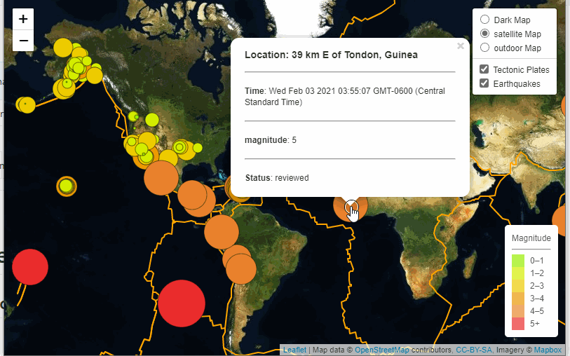

# Visualizing Data with Leaflet

[https://gotar1.github.io/leaflet-challenge/](https://gotar1.github.io/leaflet-challenge/)

## Background

United States Geological Survey, or USGS for short is responsible for providing scientific data about natural hazards, the health of our ecosystems and environment;
and the impacts of climate and land-use change. Their scientists develop
new methods and tools to supply timely, relevant, and useful information about the Earth and its processes. Earthquake data is updated every 5 minutes by USGS.

### EarthQuake Map Visualization

* Created an earthquake map using Leaflet and earthquakes data from USGS website.
* Map based on earthquake magnitude and their longitude and latitude.
* Reflect the magnitude of earthquake by their size and and depth of the earthquake by different color.
 * Earthquakes with higher magnitudes appear as larger circle and earthquakes with greater depth appear darker in color.
* Additional information about the earthquake will appear when the user clicked on it.
* Created three different map layers (dark, outdoor and satallite) for great visualization experience.
* Created a legend that will provide context for the map data.
* Plot a second data set on the map to illustrate the relationship between tectonic plates and seismic activity.

To see the Earthquake interactive map press [Here](https://gotar1.github.io/leaflet-challenge/)

